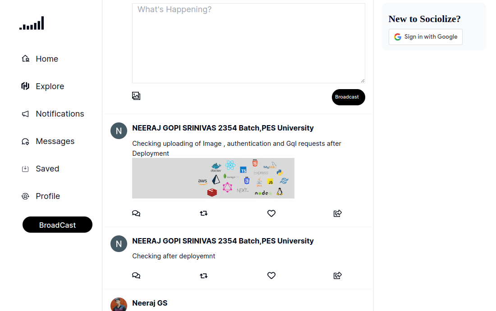
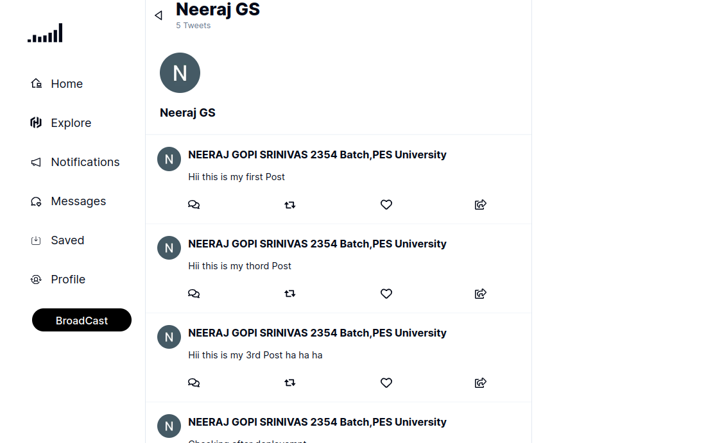
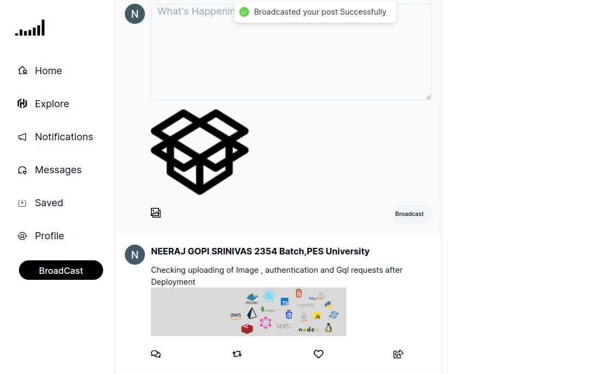
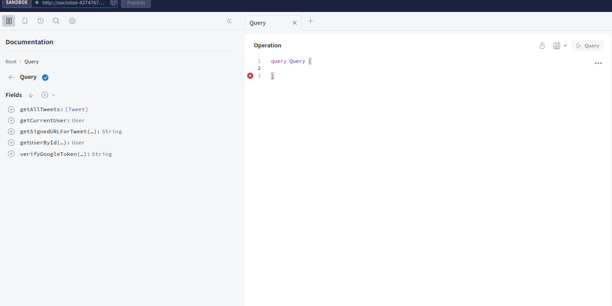
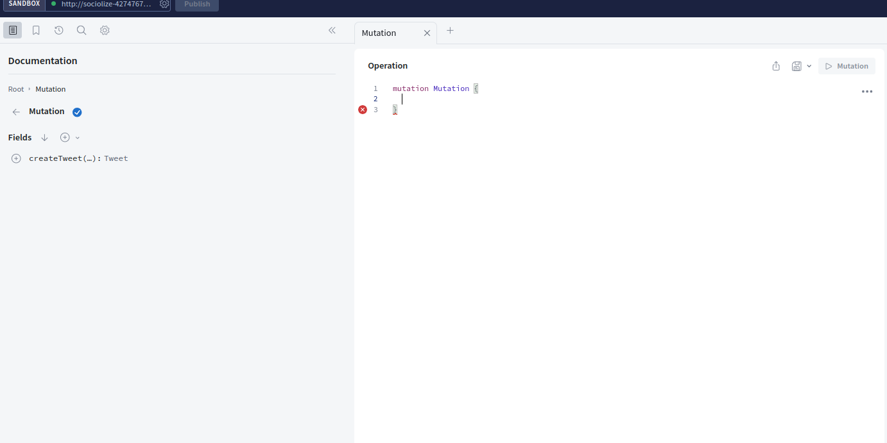

# Sociolize

A Social Media platform that allows users to share their thoughts and connect with like minded people and learn in public and grow together. Has a lot of features with the most modern stack. A Complete social media platform similar to twitter.


## Features

- Authentication using Google
- Server Side Rendered Pages
- Media Upload
- Broadcasting Messages
- Following and Unfollowing
### Tech Stack

- Next.JS
- React.JS 
- Tailwind CSS
- ShadCN UI
- GraphQL
- Express.JS
- Google Oauth
- Json web token
- PostgreSQL
- Prisma ORM
- Codegen
- TypeScript
- Graphql Request
- Amazon Web Services [AWS]


## Screenshots












## Run Locally

Clone the project

```bash
  git clone https://github.com/neeraj-gs/Sociolize.git
```

Go to the project directory

```bash
  cd client
```

Install dependencies

```bash
  npm install
```

```bash
  Add Envirnment Variables
```


Start the server

```bash
  npm run dev
```


## Environment Variables

To run this project, you will need to add the following environment variables to your .env file

`DATABASE_URL` - From Supabase

`AWS_ACCESS_KEY_ID`

`AWS_SECRET_ACCESS_KEY`

`AWS_DEFAULT_REGION`

`AWS_S3_BUCKET`


## Deployment

GraphQL Server and Frontend Both are Deployed

```bash
  https://sociolize.vercel.app/
```

